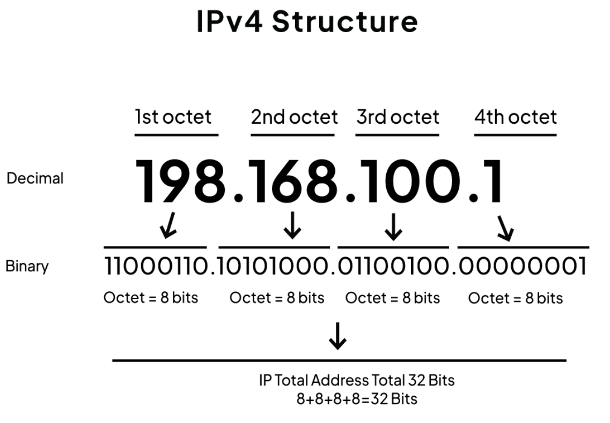

# Ip-Region-Lookup

## Project Overview: Cloud IP-to-Region Resolver
This project is designed to resolve IP addresses, such as those found in cloud logs, to their corresponding cloud service provider (CSP) and geographical region. It leverages the official, periodically updated IP-range JSON files published by AWS, Azure, and Google Cloud as its data source. An efficient data structure is implemented to store this data, ensuring high-performance lookups and rapid query responses.

<div align="center">
  
  <br>
  IPv4 Structure
</div>

## Features
- ✅ Fast IP-to-region lookup using Trie data structure
- ✅ Support for CIDR notation (e.g., 10.0.0.0/8)
- ✅ Longest prefix matching algorithm
- ✅ O(32) time complexity for lookups (constant time)
- ✅ Support for AWS, Azure, and GCP IP ranges

## Installation

### Prerequisites
- C++23 or later
- CMake 3.10+
- Git

### Build from Source
```bash
git clone https://github.com/your-username/Ip-Region-Lookup.git
cd Ip-Region-Lookup
mkdir build && cd build
cmake ..
make
```

## How It Works

### 1. IP Address Conversion
IPv4 addresses are converted to 32-bit binary:

    192.168.1.1 → 11000000 10101000 00000001 00000001

### 2. Trie Tree Construction
Each CIDR block is inserted into a binary Trie:
- Bit 0 → Left child
- Bit 1 → Right child

### 3. Longest Prefix Matching
Lookup traverses the Trie and returns the longest matching prefix.


## Data Sources
This project uses official IP range data from:
- **AWS**: https://ip-ranges.amazonaws.com/ip-ranges.json
- **Azure**: https://download.microsoft.com/download/...
- **GCP**: https://www.gstatic.com/ipranges/cloud.json

Data is automatically updated daily via GitHub Actions.


## Performance

- **Time Complexity**: O(32) for lookup (constant)
- **Space Complexity**: O(N × L) where N = number of CIDR blocks, L = prefix length
- **Typical Lookup Time**: < 1 microsecond

## Roadmap

- [ ] Add IPv6 support
- [ ] Support for more cloud providers
- [ ] REST API interface
- [ ] Performance benchmarks
- [ ] Docker support

## Acknowledgments

- AWS, Azure, and GCP for providing public IP range data
- Inspired by network routing algorithms